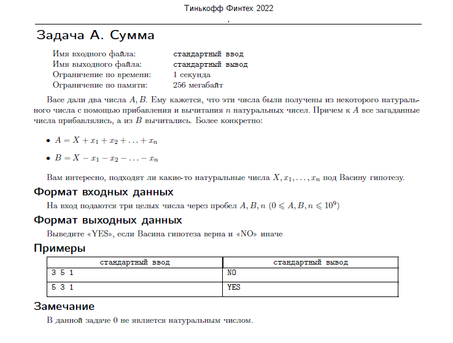
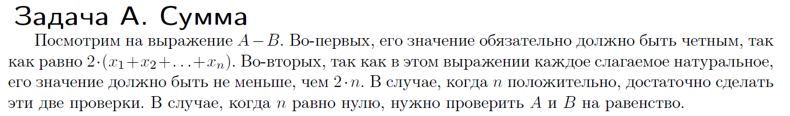

# Задача A. Сумма.


---
# Решение


---

# Код
````java

import java.util.Scanner;

/**
* Задача А. Сумма.
  */
  public class Ex1 {

  public static void main(String[] args) {
  Scanner scr = new Scanner(System.in);
  int A = scr.nextInt();
  int B = scr.nextInt();
  int n = scr.nextInt();
  scr.close();

       int x = A - B;

       if (n > 0) {
           if ((x % 2 == 0) && (x >= 2 * n)) {
               System.out.println("YES");
           } else {
               System.out.println("NO");
           }
       } else if (n == 0) {
           if (A == B) {
               System.out.println("YES");
           } else {
               System.out.println("NO");
           }
       } else {
           System.out.println("NO");
       }
  }
  }

