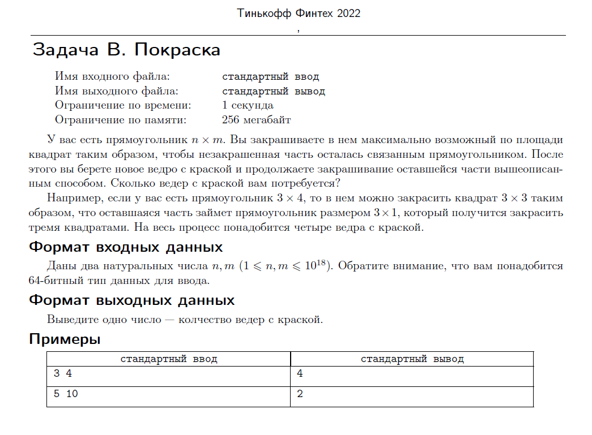

[К оглавлению](https://github.com/Musador13/Tinkoff-Contest/blob/main/README.md)

# Задача В. Покраска.


---
# Решение


---

# Код
````java

import java.util.Scanner;

/**
 * Задача В. Покраска.
 */
public class Ex2 {

    static int res = 0;

    public static void main(String[] args) {

        Scanner scanner = new Scanner(System.in);
        long n = scanner.nextLong();
        long m = scanner.nextLong();
        scanner.close();
        System.out.println(fasterFunc(n, m));
    }

    /**
     * Оптимальный метод
     *
     * @param n высота прямоугольника
     * @param m ширина прямоугольника
     * @return количество ведер с краской
     */
    static int fasterFunc(long n, long m) {

        if (n == m) {
            return 1;
        }

        if (n < m) {
            return (fasterFunc(m, n));
        }

        if (n != 0 && m != 0) {
            res += (n / m);
            fasterFunc(n % m, m);
        }
        return res;
    }

    /**
     * Неоптимальный метод
     *
     * @param n высота прямоугольника
     * @param m ширина прямоугольника
     * @return количество ведер с краской
     */
    static int slowerFunc(long n, long m) {

        if (n == m) {
            return 1;
        }

        if (n < m) {
            return (slowerFunc(m, n));
        }

        res = slowerFunc((n - m), m) + 1;
        return res;
    }
}

