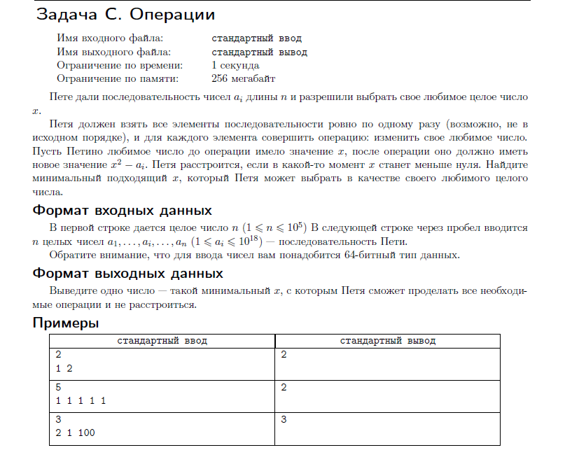
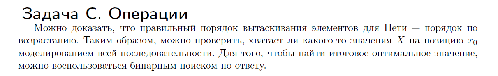

[К оглавлению](https://github.com/Musador13/Tinkoff-Contest/blob/main/README.md)

# Задача C. Операции.

---
# Решение

---
# Код
````java
import static java.lang.Math.sqrt;

import java.util.Arrays;
import java.util.Scanner;

/**
 * Задача С. Операции.
 */
public class Ex3 {

    static int func(long x) {
        return (int) Math.ceil(sqrt(x));
    }

    public static void main(String[] args) {

        Scanner scanner = new Scanner(System.in);
        int n = scanner.nextInt();
        long[] array = new long[n];

        for (int i = 0; i < n; i++) {
            array[i] = scanner.nextLong();
        }
        Arrays.sort(array);

        long x = func(array[array.length - 1]);

        for (int i = array.length - 2; i >= 0; i--) {
            x = func(array[i] + x);
        }

        System.out.println(x);
        scanner.close();
    }
}


